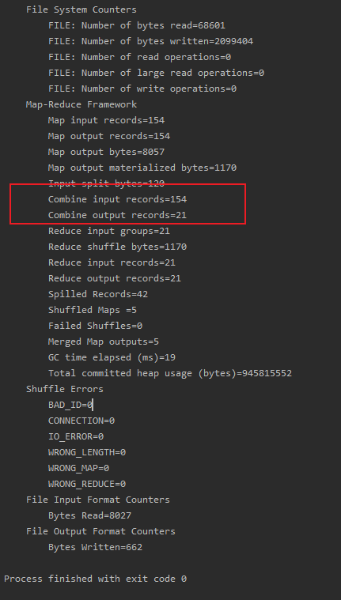
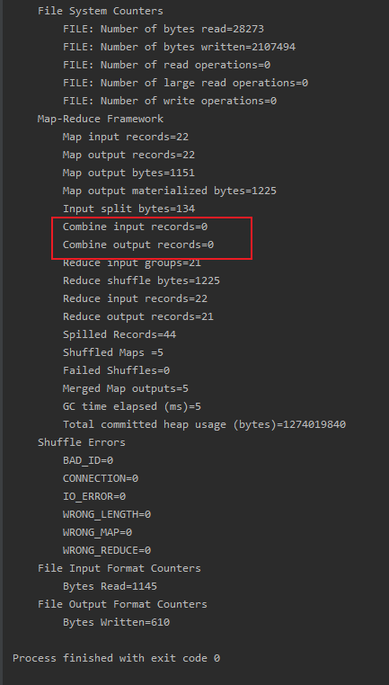

需要Combiner 则在Driver中设置:
```$java
job.setCombinerClass( MyCombiner.class);
```
如果reduce的输入输出类型路径一致则可以直接设置为reducer.class

有Combine,可以看到在各个mapTask中已经先预先reduce了



如果没有Combine,可以看到Combine没有计数



Combiner和reducer的分组是按照输入输出上下文的相同key分组的，但是在map阶段，

分组的依据却不一定要按照输入输出的key，完全可以自定义，可以是key里面的某个字段，

例如本案例中，输出的key是MyKeyBean这样的object,但是在map阶段的分组依据可以是MyKeyBean里面的phoneNum字段，

但在reduce或在Combiner分组时，是按照MyKeyBean来分组的。


