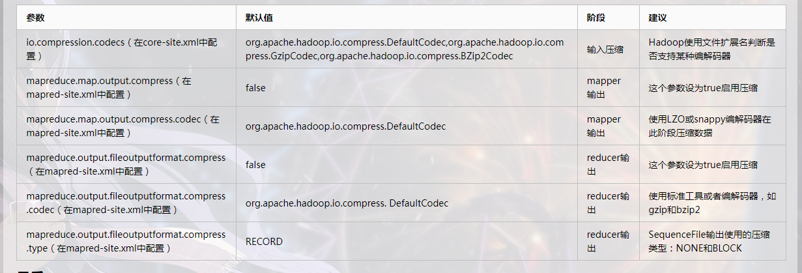

### 基本原则
（1）运算密集型的job，少用压缩。

（2）IO密集型的job，多用压缩。

### 压缩参数


### 开启map端输出压缩
```shell script
configuration.setBoolean("mapreduce.map.output.compress", true);
// 设置map端输出压缩方式
configuration.setClass("mapreduce.map.output.compress.codec", BZip2Codec.class, CompressionCodec.class);
```

### 设置reduce端输出压缩开启
```shell script
FileOutputFormat.setCompressOutput(job, true);      
// 设置压缩的方式
FileOutputFormat.setOutputCompressorClass(job, BZip2Codec.class); 
//FileOutputFormat.setOutputCompressorClass(job, GzipCodec.class); 
//FileOutputFormat.setOutputCompressorClass(job, DefaultCodec.class); 

```
